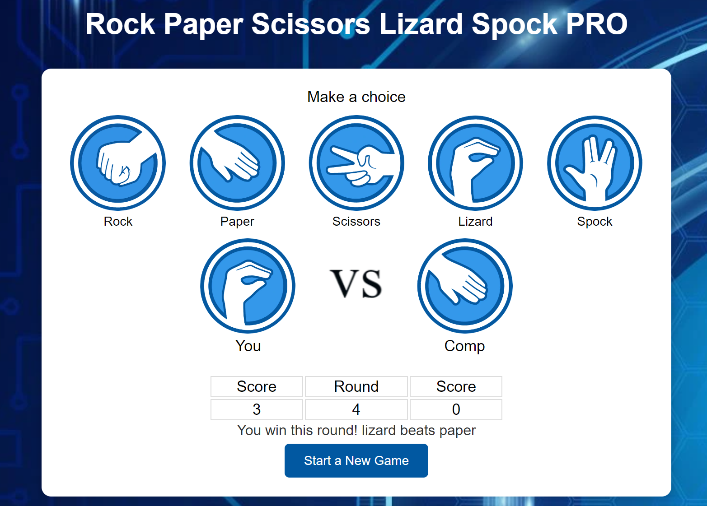

# Rock Paper Scissors Lizard Spock PRO

This is a simple implementation of the Rock Paper Scissors Lizard Spock game, a variation of the classic Rock Paper Scissors game popularized by the TV show "The Big Bang Theory." In this version, there are five possible moves: Rock, Paper, Scissors, Lizard, and Spock. The game is played against the computer, and the winner is determined based on the rules:

- Rock crushes Scissors
- Scissors cuts Paper
- Paper covers Rock
 -Rock crushes Lizard
- Lizard poisons Spock
- Spock smashes Scissors
- Scissors decapitates Lizard
- Lizard eats Paper
- Paper disproves Spock
- Spock vaporizes Rock

## Usage

Once the game is running, you'll be prompted to choose your move by clicking on one of the icons (Rock, Paper, Scissors, Lizard, or Spock).
The computer AI will also make its move.
The game will display the result (win, lose, or tie), and keep track of your score.
## Screenshots

## Features 

- Simple and intuitive gameplay.
- A fun twist on the classic Rock Paper Scissors game.
- Play against the computer AI.
- A graphical user interface (GUI) for an enjoyable user experience.

### Existing Features

- __Header__

  - The header is logically located at the top of the page where it displays the name of the game,
  
- __Buttons__

  - There are five attractive clickable buttons, with button name labels and images of Rock Paper Scissors Lizard and Spock.

- __score section__

  - Score area displays score for both players for each round of the Game

- __Game Result__

    - After 10 Rounds a popup displays the Game winner, who has won the most Rounds.

- __Footer__

  - At the bottom of the game area, there's a section for detailed game Rules, which is very useful for players to understand the logic of the Game.

## Testing 

 - Its tested that Game Supports different browsers like Chrome, Firfox, Safari.
  - Its tested that the Game results are always correct.
- The game performance is tested with lighthouse, which is more than 90%.

### Validator Testing 

- HTML
  - No errors were returned when passing through the official [W3C validator](https://validator.w3.org/nu/?doc=https%3A%2F%2Fcode-institute-org.github.io%2Flove-running-2.0%2Findex.html)
  
- CSS
  - No errors were found when passing through the official [(Jigsaw) validator](https://jigsaw.w3.org/css-validator/validator?uri=https%3A%2F%2Fvalidator.w3.org%2Fnu%2F%3Fdoc%3Dhttps%253A%252F%252Fcode-institute-org.github.io%252Flove-running-2.0%252Findex.html&profile=css3svg&usermedium=all&warning=1&vextwarning=&lang=en#css)
  

- JavaScript

  - No errors were found when passing through the [JsHint JacaScript Validator](https://jshint.com/)

### fixed Bugs

- while making there was constantly showing up 2 errors in JavaScript, that "let" is already decleared. but there was no double declaration. after a long search i have found the Bug, that link for JavaScript in Html page was twice.i removed one link, the error was resolved. 

## Deployment

This section should describe the process you went through to deploy the project to a hosting platform (e.g. GitHub) 

- The site was deployed to GitHub pages. The steps to deploy are as follows: 
  - In the GitHub repository, navigate to the Settings tab 
  - From the source section drop-down menu, select the Master Branch
  - Once the master branch has been selected, the page will be automatically refreshed with a detailed ribbon display to indicate the successful deployment. 

The live link can be found here [Rock Paper Scissors Lizard Spock PRO](-https://marcopolo1975.github.io/Rock-Paper-Scissors-Lizard-Spock-PRO/)

## Credits 

### Content 

- throughout the making, got a lots of guidance from W3s and youtube Tutorials 

### Media

- Background image is taken from, Freepic.com
- Icones are Taken form https://rpslo.netlify.app/

